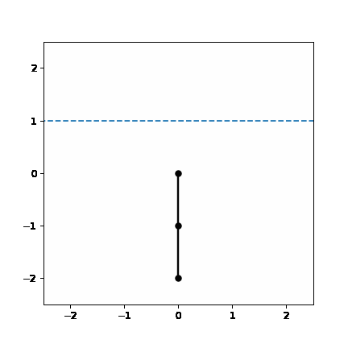

# IT3105

Artificial Intelligence Programming course at NTNU. The course consist of 3 different projects where reinforcement learning is an essential topic.

## Poject 1 - General-Purpose RL System

General-purpose Actor-Critic Model (ACM) for Reinforcement Learning. Applied to three different problems: pole-balancing, Towers of Hanoi, and the gambler.

## Project 2 - On-Policy Monte Carlo Tree Search for Game Playing

General-purpose Monte Carlo Tree Search (MCTS) system for use in a complex 2-person game.

## Project 3 - Reinforcement Learning with Coarse Coding for Acrobat Control

Use Coarse Coding (Tile encoding) and SARSA to solve the Acrobat problem. Agent uses a single layer neural network to estimate Q(S,A).

